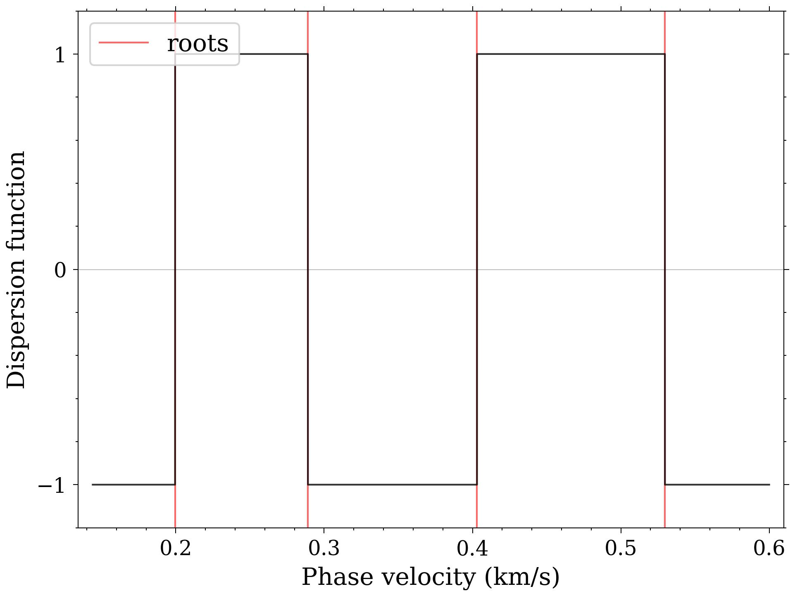

# mode-kissing
Efficient Computation of Dispersion Curves in Low-velocity Layered Half-spaces

A recurring challenge in practical scenarios involves models incorporating low-velocity layers, where the occurrence of ``mode-kissing'' and missing roots presents difficulties. In response to this issue, we present an algorithm designed to generate supplementary samples between neighboring roots at points of mode-kissing. This innovative approach leverages the fast delta matrix algorithm in conjunction with a root-searching technique. By incorporating additional samples, our proposed algorithm demonstrates remarkable efficacy and stability, establishing itself as a valuable tool with broad applicability in related fields.

## Dependencies

Install these external libraries according to the operating system, e.g. aptitude, pacman

- [Eigen3](https://eigen.tuxfamily.org/index.php?title=Main_Page)
- [HDF5](https://en.wikipedia.org/wiki/Hierarchical_Data_Format)

## Complie

```bash
> git clone https://github.com/pan3rock/mode-kissing.git
> cd mode-kissing
> git submodule init
> git submodule update
> mkdir build
> cd build
> cmake ..
> make
```

## Examples

There are four instances located in the directory [demo](./demo) corresponding to Model 1-4.
For illustrative purposes on the computation of dispersion curves and 
the generation of certain figures in our paper, we will focus on [model1](./demo/model1).

```bash
> # the position here is the main directory of the program
> cd demo/model1
> ls .
config.toml model.txt
```

The configuration file `config.toml` serves as the configuration file for the executable, containing easily understandable parameters. On the other hand, `model.txt` functions as the model input file providing descriptions of model parameters. Each line in `model.txt` includes parameters such as the "index of layers", "depth of the top interface of the layer", "density", "Vs" and "Vp". It is important to note that the numbers in the first column have no significance during the program's execution.

1. **Calculation of dispersion curves**
    ```bash
    > ../../bin/forward
    > ../../python/plot_disp disp.txt
    ```
    The information of every command can be inquired by adding "-h", and more functional arguments are provided.

    

2. **Scanning the dispersion function along phase velocities**

    ```bash
    > ../../bin/secfunc 10
    > ../../python/plot_secfunc.py secfunc.h5
    ```
    The command is to compute the dispersion function at the frequency 10 Hz.

    

    To produce Figure 7(a), you can uncomment the line "cmin = 0.271" and "cmax = 0.284" in config.toml, then

    ```bash
    > ../../bin/secfunc 30.7
    > ../../python/plot_secfunc.py secfunc.h5 --sample --sample_pred --xlim 0.271 0.284
    ```

    


3. **Calculation of dispersion curves if the proposed algorithm not applied**
    ```bash
    > ../../bin/forward --lvl -1
    > ../../python/plot_disp disp.txt
    ```

    

4. **Calculation of dispersion curves if the iteration ends at the LVL**
    ```bash
    > ../../bin/forward 
    > cp disp.txt disp_full.txt
    > ../../bin/forward --lvl 2 
    > ../../python/plot_disp disp.txt --file_ref disp_full.txt
    ```

    

## References

- Pan, L. & Chen X. (submitted). Efficient Computation of Dispersion Curves in Low-velocity Layered Half-spaces.
Bulletin of the Seismological Society of America.
- Buchen, P. W., & Ben-Hador, R. (1996). Free-mode surface-wave computations. Geophysical Journal International, 124(3), 869-887.
- Fan, Y., Chen, X., Liu, X., Liu, J., & Chen, X. (2007). Approximate decomposition of the dispersion equation at high frequencies and the number of multimodes for Rayleigh waves. Chinese Journal of Geophysics, 50(1), 222-230.
